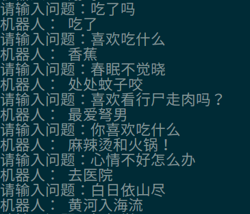

# Seq2Seq Generative Chat-bot Baseline

A Seq2Seq generative chat-bot baseline implemented by Tensorflow.

- Python: 3.6
- Tensorflow: 1.12

### Model Architecture

GRU Seq2Seq + Luong Attention + Beam Search

## Usage:

First, clone our repository to your computer and install dependencies:

```
git clone https://github.com/applenob/tf_chat_seq2seq.git
cd tf_chat_seq2seq
pip install -r requirements.txt
```

### Prepare the Dataset

Download Chinese dialogue data from [Dialog_Corpus](https://github.com/candlewill/Dialog_Corpus).

```
git clone https://github.com/candlewill/Dialog_Corpus.git input
```

Then `unzip` the data.

Make sure we can visit data by path like `input/xiaohuangji50w_nofenci.conv`.

Then, you can change the configure in file `config.yml`.

Generate vectorized data:

```
python data_process.py --conv_path input/xiaohuangji50w_nofenci.conv
``` 

### Try Tensorflow version model

Train Tensorflow version seq2seq model:

```
python main_tf.py --mode train
```

Have fun with the model you have trained:

```
python main_tf.py --mode predict
```

## For Producing

Freezing model from checkpoint to proto-buffer file:

```
python tools/freeze_graph.py
```

Now, you can run your model with pb format:

```
python main_pb.py
```

## Result Samples

